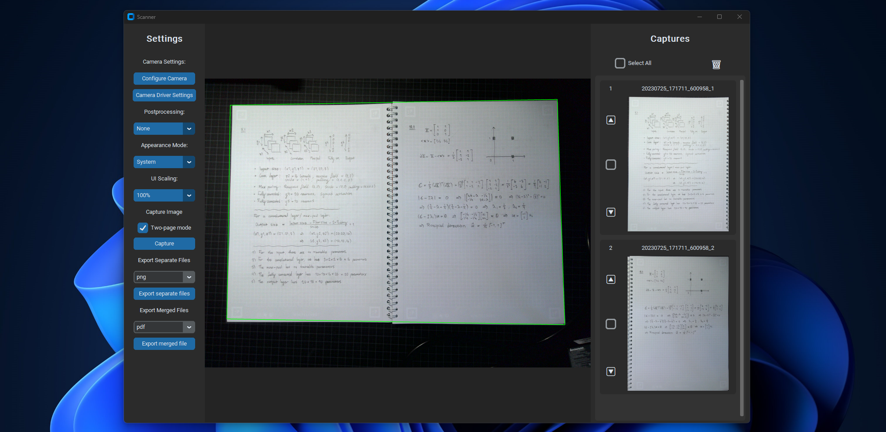

[](https://opensource.org/licenses/MIT)
[](https://github.com/psf/black)

[](https://github.com/suhren/camscan/actions/workflows/format.yml)
[](https://github.com/suhren/camscan/actions/workflows/lint.yml)
[](https://github.com/suhren/camscan/actions/workflows/test.yml)

# Camscan

**Camscan** is a software for scanning documents using a camera connected to your computer, like your webcam. It is fully implemented in Python, and mainly leverages [OpenCV](https://github.com/opencv/opencv-python) for the document detection algorithm, and [CustomTkinter](https://github.com/TomSchimansky/CustomTkinter) for the graphical user interface.

<p align="center">
  <picture>
    
  </picture>
</p>

The functionality of the software includes, but is not limited to:

- Computer-vision algorithm capable of identifying, and extracting contents of documents found through the camera
- Ability to process two-sided documents (like books) and extract the left and right pages as a separate images
- A fully fledged graphical user interface (no requirement of coding, setting values in config files, or using the terminal)
- Post-processing functions of captured images, like sharpening and black and white threshold
- Ability to re-order or remove images after capture
- Ability to export captures:
  - As separate files to a directory with a wide range of formats like `.png`, `.jpg`, and many others.
  - As a concatenated `.pdf` file containing all the captures.
  
## Installation

You can find the latest available pre-build standalone executables for this
software available at the [releases section in ths repo](https://github.com/suhren/camscan/releases). Simply download the version for your platform and run it.

- For Windows, download `camscan-windows.exe` file and run it by double-clicking it
- For Linux, download `camscan-linux`. Then open a terminal and navigate to the file. Make it executable with `chmod +x camscan-linux`, then run it with `./camscan-linux`

## Running as a Python module

You can also run the camera scanner application as a Python module using your own environment.

## Using conda

You can set up a conda environment using the below commands:

```bash
conda create -n camscan python=3.11
conda activate camscan
pip install -r requirements.txt
python -m camscan.app
```

**NOTE**: Using anaconda or miniconda only linux will lead to some rendering problems with the TkInter GUI components. Therefore, it is recommended to not use anaconda or miniconda when creating your python environment when using linux. Instead, you can simply install the required Python version yourself, or use another solution like "pyenv" (see further down). 

See the following threads on the subject:

- https://github.com/TomSchimansky/CustomTkinter/issues/1400
- https://stackoverflow.com/questions/49187741/tkinter-looks-extremely-ugly-in-linux
- https://github.com/ContinuumIO/anaconda-issues/issues/6833

## Using pyenv

### Installing pyenv

```bash
# Instructions taken from the pyenv installation guide:
# https://github.com/pyenv/pyenv?tab=readme-ov-file#linuxunix

# Required to download the pyenv installer
sudo apt install curl

# Install Pyhon build dependencies
sudo apt update
sudo apt install make build-essential libssl-dev zlib1g-dev libbz2-dev libreadline-dev libsqlite3-dev curl git libncursesw5-dev xz-utils tk-dev libxml2-dev libxmlsec1-dev libffi-dev liblzma-dev libzstd-dev

# Download and install pyenv 
curl -fsSL https://pyenv.run | bash

# Set up your .bashrc file to make pyenv avialable in the shell 
echo 'export PYENV_ROOT="$HOME/.pyenv"' >> ~/.bashrc
echo '[[ -d $PYENV_ROOT/bin ]] && export PATH="$PYENV_ROOT/bin:$PATH"' >> ~/.bashrc
echo 'eval "$(pyenv init - bash)"' >> ~/.bashrc

# Update the shell environment
source ~/.bashrc
```

### Creating a pyenv environment

```bash
pyenv install 3.11
pyenv shell 3.11
python -m venv venv
source venv/bin/activate
pip install -r requirements.txt
```


## Build instructions

Build the software as a standalone application using the following commands.

Some notes:

- To build the application as an executable, you need to also ensure that the "pyinstaller" python module has ben installed.
- Some imports required by the application might not be collected properly by pyinstaller. To fix this, provide them as "hidden" imports. See [this stackoverflow thread](https://stackoverflow.com/questions/52675162/pyinstaller-doesnt-play-well-with-imagetk-and-tkinter) on the subject

```bash
# If you are building on Windows
pyinstaller --onefile --name camscan-windows camscan/app.py --hidden-import "PIL" --hidden-import "PIL._imagingtk" --hidden-import "PIL._tkinter_finder"
# If you are building on Linux
pyinstaller --onefile --name camscan-linux camscan/app.py --hidden-import "PIL" --hidden-import "PIL._imagingtk" --hidden-import "PIL._tkinter_finder"
```

and then find the resulting executable file in `dist/camscan-windows.exe` for Windows, or `dist/camscan-linux` for Linux.