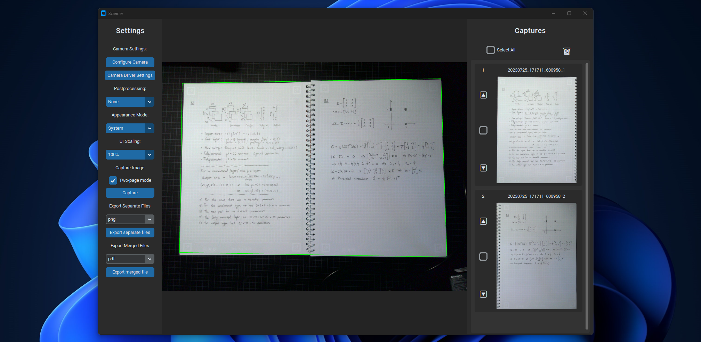

[](https://opensource.org/licenses/MIT)
[](https://github.com/astral-sh/ruff)

[](https://github.com/suhren/camscan/actions/workflows/ruff.yml)
[](https://github.com/suhren/camscan/actions/workflows/mypy.yml)
[](https://github.com/suhren/camscan/actions/workflows/test.yml)

# Camscan

**Camscan** is a software for scanning documents using a camera connected to your computer, like your webcam. It is fully implemented in Python, and mainly leverages [OpenCV](https://github.com/opencv/opencv-python) for the document detection algorithm, and [CustomTkinter](https://github.com/TomSchimansky/CustomTkinter) for the graphical user interface.

<p align="center">
  <picture>
    
  </picture>
</p>

The functionality of the software includes, but is not limited to:

- Computer-vision algorithm capable of identifying, and extracting contents of documents found through the camera
- Ability to process two-sided documents (like books) and extract the left and right pages as a separate images
- A fully fledged graphical user interface (no requirement of coding, setting values in config files, or using the terminal)
- Post-processing functions of captured images, like sharpening and black and white threshold
- Ability to re-order or remove images after capture
- Ability to export captures:
  - As separate files to a directory with a wide range of formats like `.png`, `.jpg`, and many others.
  - As a concatenated `.pdf` file containing all the captures.
  
## Installation

You can find the latest available pre-build standalone executables for this
software available at the [releases section in ths repo](https://github.com/suhren/camscan/releases). Simply download the version for your platform and run it.

- For Windows, download `camscan-windows.exe` file and run it by double-clicking it
- For Linux, download `camscan-linux`. Then open a terminal and navigate to the file. Make it executable with `chmod +x camscan-linux`, then run it with `./camscan-linux`

## Running as a Python module

You can also run the camera scanner application as a Python module using your own environment.

This project uses [uv](https://docs.astral.sh/uv/) as the python package and project manager.
If you have `uv` installed, the setups is simply as simple as running the app directly:

```bash
# If it is the first time running the app, the uv run will also create the venv first
uv run -m camscan.app
```

## Build instructions

Build the software as a standalone application using the following command:

```bash
uv run build.py
```

You can then find the resulting executable file in the `dist` folder.
